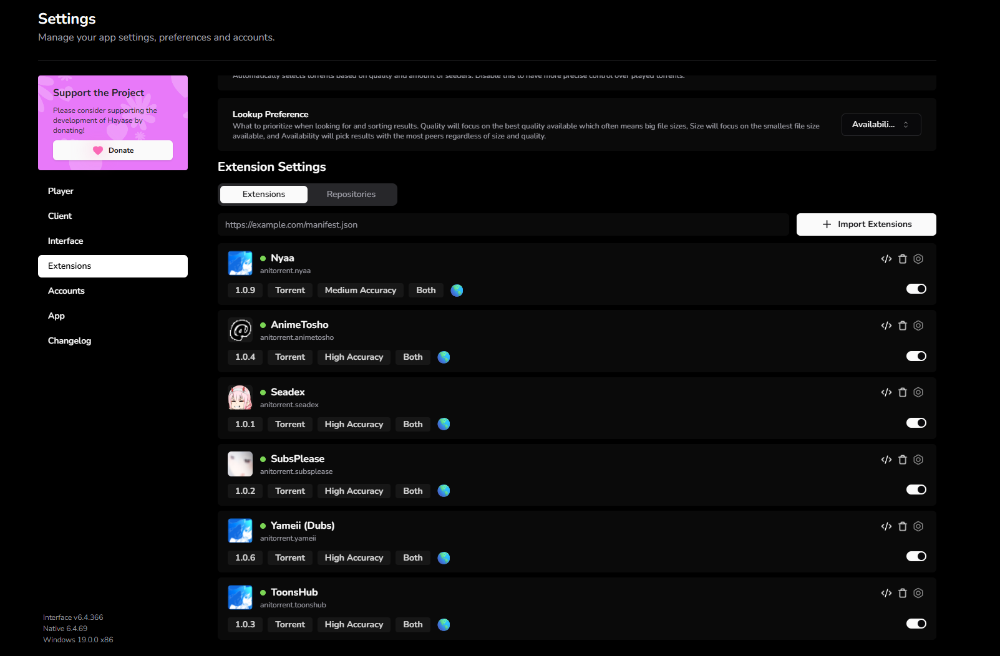
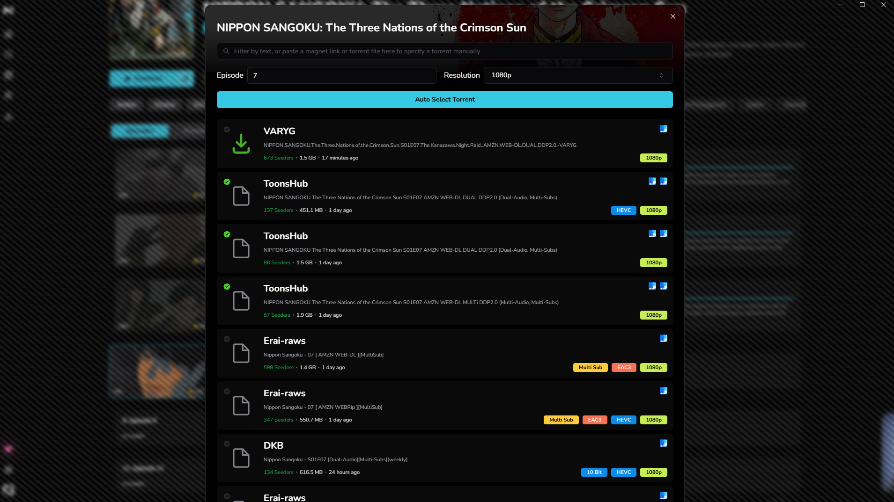

<p align="center">
  <picture>
    <source media="(prefers-color-scheme: dark)" srcset="./.github/assets/title-dark.svg">
    
  </picture>
</p>

<p align="center">
  Anime torrent extension built for <a href="https://hayase.watch">Hayase</a>.<br>
  Six toggleable sources, auto-updating in the background, no manual maintenance.<br>
  <sub>Replaces the abandoned <code>hayase-app</code> extensions (Nyaa, AnimeTosho, Seadex) that have been marked Outdated for months.</sub>
</p>

## Install in Hayase

Settings → Extensions → Repositories → paste → Import Extensions:

```
https://raw.githubusercontent.com/anh9000/anitorrent/main/hayase/index.json
```

That's it. One-time action. Hayase auto-polls the manifest on every launch, so any future release flows in automatically without re-importing.

### Shiru install URL (untested, try at your own risk)

```
https://raw.githubusercontent.com/anh9000/anitorrent/main/shiru/index.json
```

Settings → Extensions → paste.

> **Shiru note:** a [Shiru](https://github.com/RockinChaos/Shiru) manifest is also published, but this has **not been tested in an actual Shiru install**. The code was designed against the lowest-common-denominator API both apps accept, so it should work. If you try it in Shiru and hit a problem, please [open an issue](https://github.com/anh9000/anitorrent/issues) with the details.

## Tested on

Built and verified against this Hayase build:

| Component | Version |
|---|---|
| Hayase Interface | `v6.4.366` |
| Hayase Native | `6.4.69` |
| Platform | Windows |
| All six sources online | verified `2026-05-18` |

The extensions page in Hayase, all six sources green and current:

<p align="left">
  <a href="https://raw.githubusercontent.com/anh9000/anitorrent/main/.github/assets/installed-extensions.png">
    
  </a>
</p>

What a search looks like (Nippon Sangoku, episode 7), pulling results from multiple sources in one panel:

<p align="left">
  <a href="https://raw.githubusercontent.com/anh9000/anitorrent/main/.github/assets/search-results.png">
    
  </a>
</p>

## Sources

### Core (recommended for everyone)

| Source | Accuracy | Best for |
|---|---|---|
| Nyaa | medium | Raw firehose, full coverage of every anime upload |
| AnimeTosho | high | Anidb-mapped lookups for older / popular shows + batch packs |
| Seadex | high | Community-curated "best release" picks |
| SubsPlease | high | Currently-airing weekly fansubs |

### Curator picks (optional)

These are personal picks that ship enabled by default but are entirely toggleable.<br>Disable them in Settings → Extensions if you don't want them.

| Source | Accuracy | What it adds |
|---|---|---|
| Yameii | high | Single uploader's English dub re-encodes from nyaa. Narrow catalog but consistent quality. IRC: `#Yameii@irc.rizon.net` |
| ToonsHub | high | Releases from the ToonsHub group: dual-audio and multi-sub variants for many currently-airing shows. Telegram: [t.me/thtorrents](https://t.me/thtorrents) |

All six sources declare `media: "both"` in the manifest. Hayase shows Sub + Dub badges regardless. The badge is purely informational, it does not filter results.

## Frequently asked questions

### Where can I find Hayase extensions?

This repo is one option. The previously-popular extensions in the `hayase-app` ecosystem (Nyaa, AnimeTosho, Seadex) have been marked Outdated and unmaintained for months. This pack picks up where they left off with six current, auto-updating sources.

### How do I install extensions in Hayase?

Open Hayase. Settings, then Extensions, then the Repositories tab. Paste the install URL into the textbox at the top. Click Import Extensions. The sources appear in the Extensions tab where you can toggle each one on or off independently.

### How do I update Hayase extensions?

Hayase auto-polls every extension's manifest URL on launch. As long as the extension's `update` field points to a maintained URL, new versions flow in automatically when you restart Hayase. For this pack specifically, just relaunch Hayase. All six sources stay current with no action from you.

### Why are my existing Hayase extensions marked "Outdated"?

The Outdated badge means the upstream manifest published a higher version number than what you have installed. For the official `hayase-app` extensions, this means the maintainers stopped publishing updates. Either delete those and import this pack, or wait for the original maintainers to ship a new version.

### Does this Hayase extension work on Android?

Yes. The same install URL works in Hayase on Android (8.0 or later). iOS is not supported because Hayase itself is not available on iOS, since Apple bans BitTorrent apps from the App Store.

### Is this Hayase extension safe?

All source code is in this public repo. It only talks to public APIs (`nyaa.si`, `feed.animetosho.org`, `releases.moe`, `subsplease.org`). No tracking, no analytics, no authentication. Every source file is in the `src/` directory and the bundles in `dist/` are auto-built from those sources by GitHub Actions.

### What sources does this pack include?

Six: Nyaa (raw firehose), AnimeTosho (anidb-mapped aggregator), Seadex (community-curated best releases), SubsPlease (weekly fansubs), Yameii (English dubs), and ToonsHub (dual-audio and multi-sub group releases). All toggleable.

## ID mapping

`data/anilist-to-anidb.json` is a compact 170 KB map (~13,000 pairs) extracted from the [manami-project anime-offline-database](https://github.com/manami-project/anime-offline-database). The AnimeTosho extension fetches this file on first call (cached in memory for the session) to convert AniList IDs to AniDB IDs when Hayase doesn't provide them, enabling high-accuracy lookups via AnimeTosho's `?aid=<id>` endpoint.

The mapping is regenerated weekly by `.github/workflows/mappings.yml` running `.github/scripts/build-mappings.js`. Manami publishes "Delta Update" commits multiple times per week and tagged weekly releases, so the chain stays fresh automatically with no manual action.

## Develop

```
npm install
npm run build
npm test
```

`src/lib/shared.js` holds all the matching/query logic shared by every source (single source of truth). Each source in `src/` imports from it and is bundled into a standalone `dist/*.js` by tsup. CI rebuilds `dist/` on every push that touches `src/`, `package.json`, or `tsup.config.js`. `npm test` runs the relevance suite in `test/` against live nyaa.si.

## Changelog

See [CHANGELOG.md](./CHANGELOG.md) for the full version history.

## License

GPL-3.0. See [LICENSE](./LICENSE).
